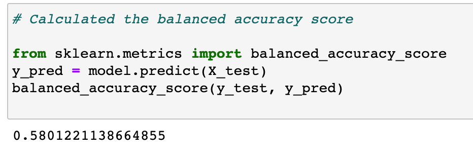
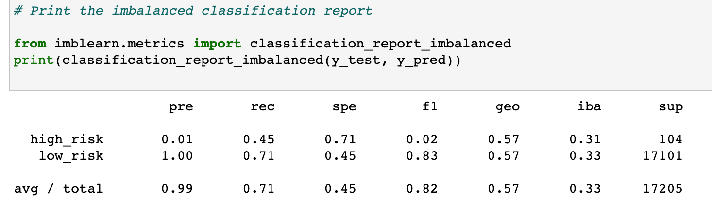
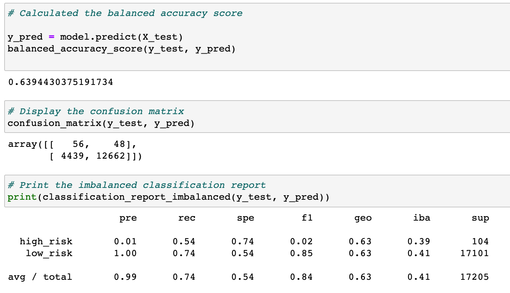
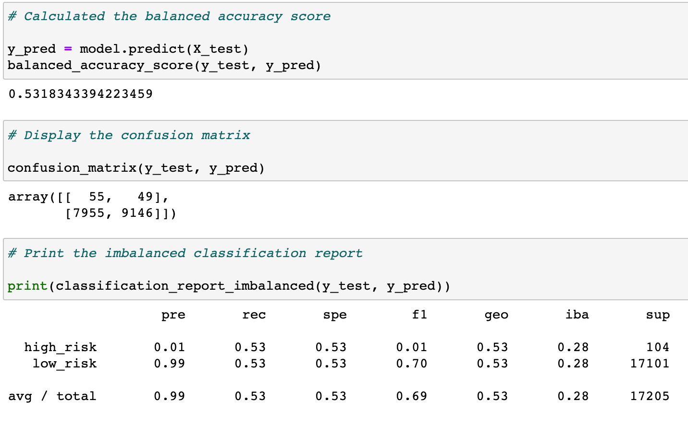
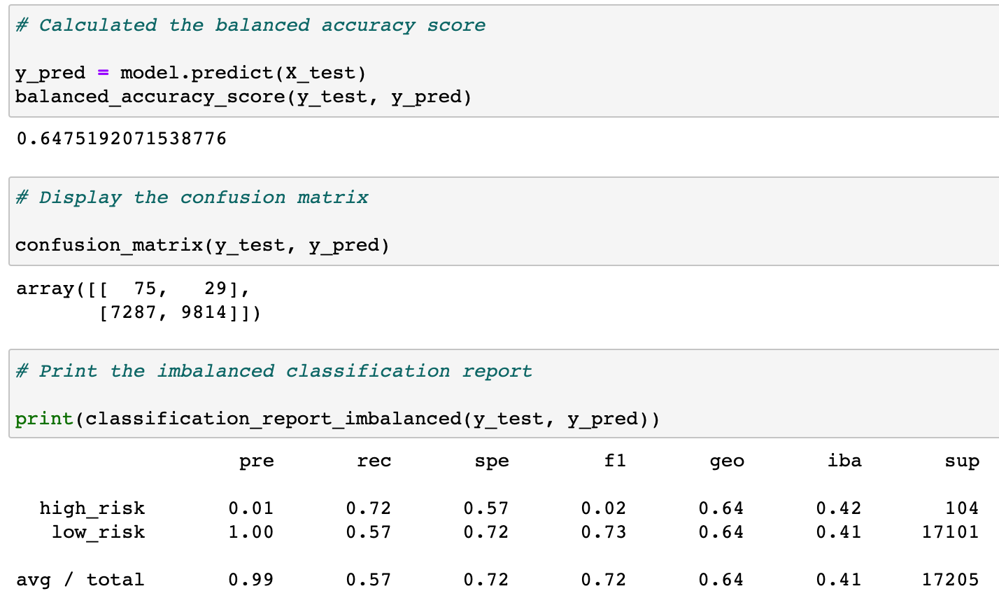
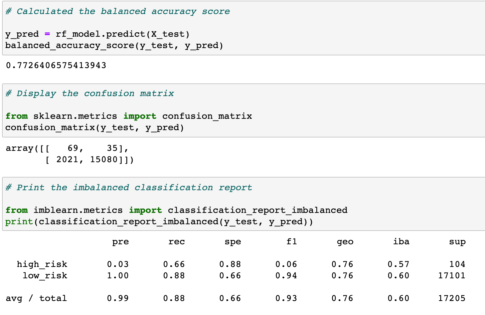
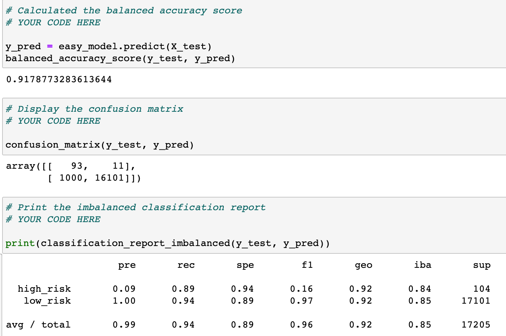

# Credit_Risk_Analysis

## Table of Contents
- [1.0 Project Overview](#Project-Overview)
  * 1.1 Purpose
  * 1.2 Resources
- [2.0 Results](#Results)

- [3.0 Summary](#Summary)

## Project Overview
### 1.1 Purpose
Credit risk is a tough challenge to predict. The imbalanced data from LendingClub will be trained with different techniques of undersampling and oversampling to better predict credit risk. Oversampling was conducted with RandomOverSample and SMOTE, and undersampling was conducted using ClusterCentroids algorithm. A combination method was also used called SMOTEEN algorithm. After BalancedRandomForestClassifier and EasyEnsembleClassifier are used to reduce bias and predict credit risk. 

### 1.2 Resouces
- LoadStats_2019.csv
- Python
  - scikit-learn
  - imbalanced-learn

## Results

Naive Random Oversampling:

The balanced accuracy score is 58%.

  

The precision for high risk is 1% and the recall is 45%. 

  

SMOTE Oversampling: 
The balanced accuracy score is 64%. The precision for high risk is 1% and the overall recall is 74%.

  

Undersampling:
The balanced accuracy score is 53%. The precision for high risk is 1% and the recall score is 53%. 

 

Combination (Over and Under) Sampling:
The balanced accuracy score is 65%. The overall precision is 99% and the recall score is 57%. 

Balanced Random Forest Classification:
The balanced accuracy score is 77%. The high risk precision increases to 3% and the recall score is 66%. 

Easy Ensemble AdaBoost Classifier:
The balanced accuracy score is 92%. The high risk precision is 9% and the recall score is 89%. 

## Summary

